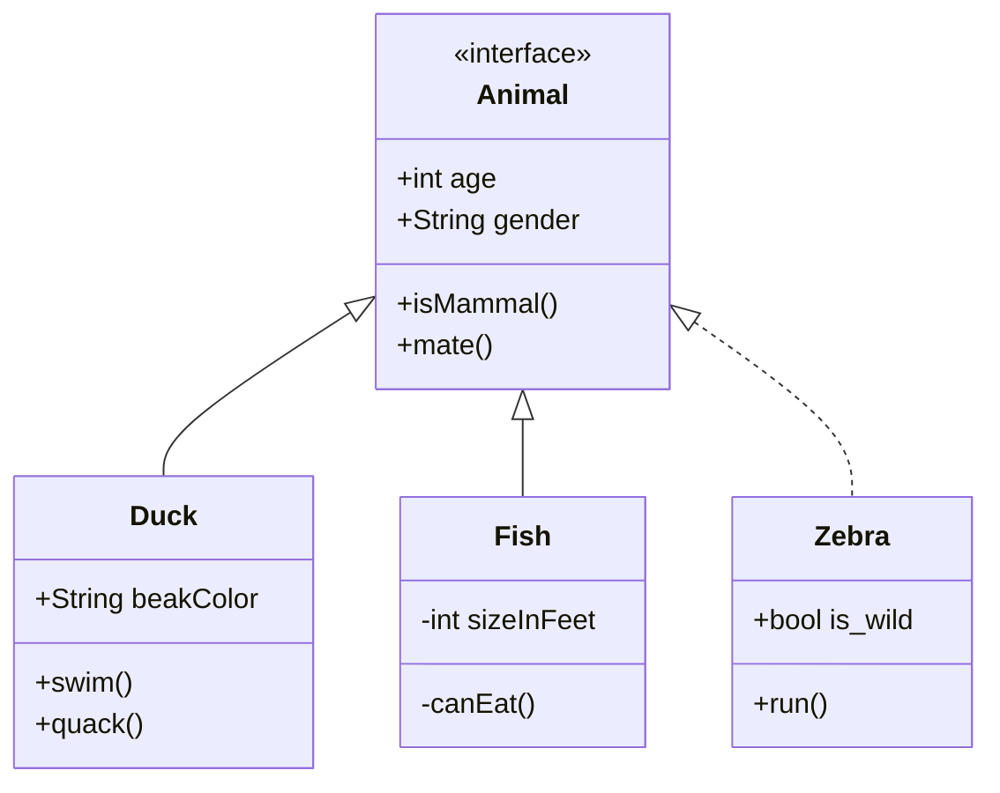

```mermaid
classDiagram
    Animal <|-- Duck
    Animal <|-- Fish
    Animal <|.. Zebra

    class Animal{
        <<interface>>
        +int age
        +String gender
        +isMammal()
        +mate()
    }
    class Duck{
      +String beakColor
      +swim()
      +quack()
    }
    class Fish{
      -int sizeInFeet
      -canEat()
    }
    class Zebra{
      +bool is_wild
      +run()
    }
```
